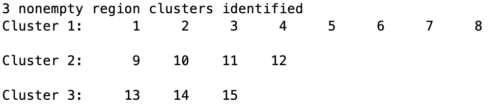
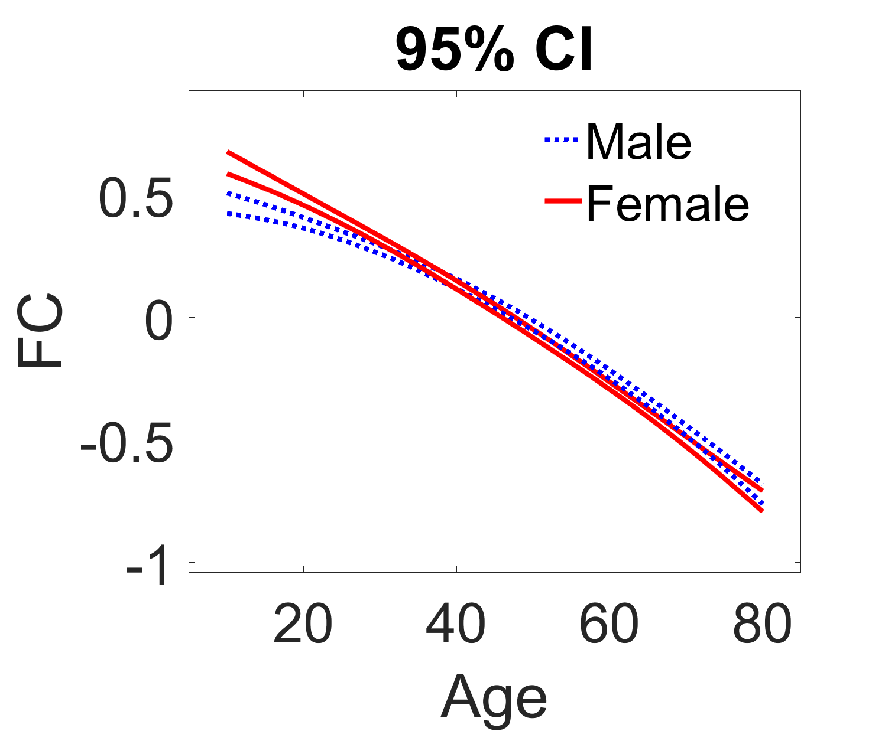
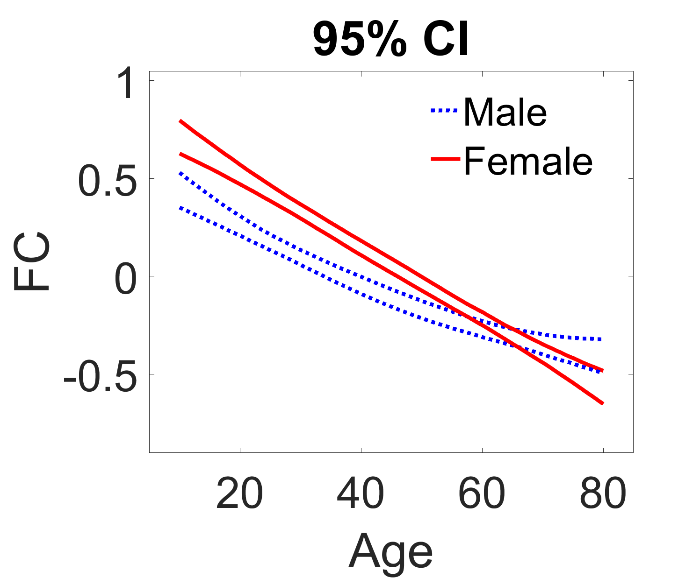
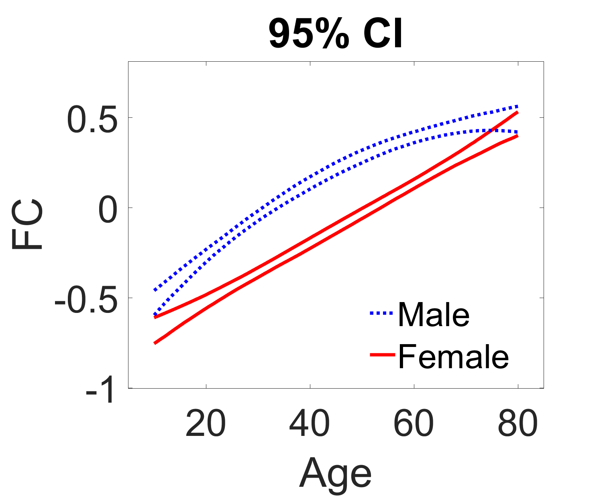
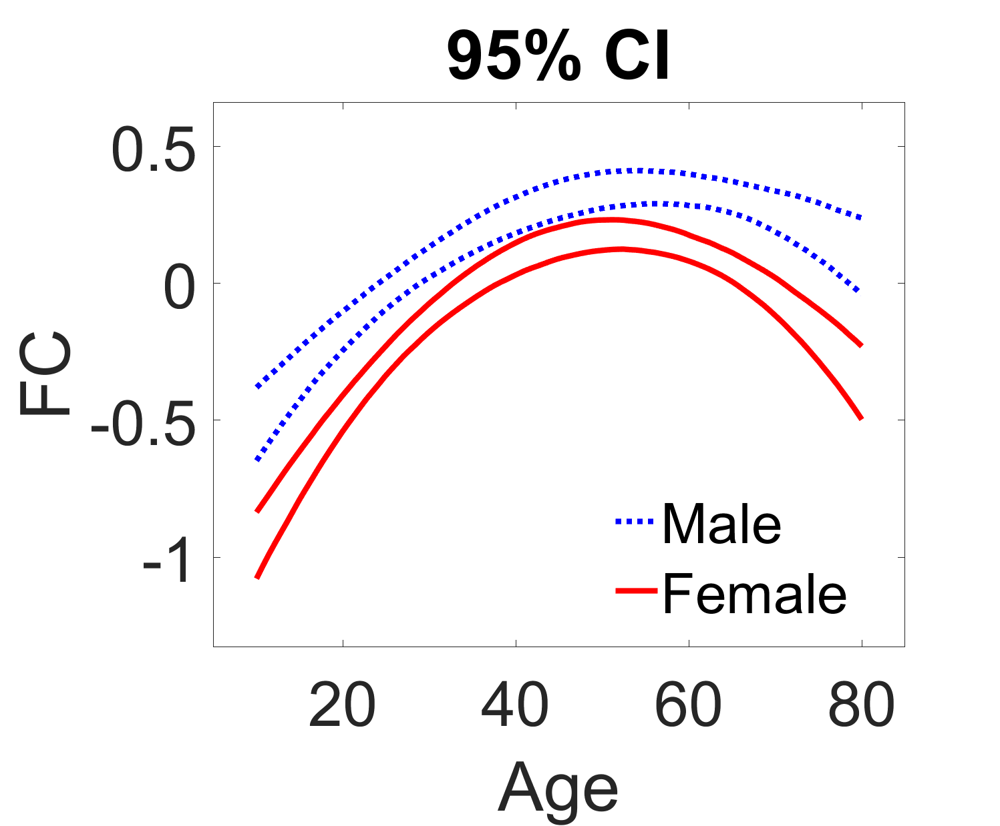
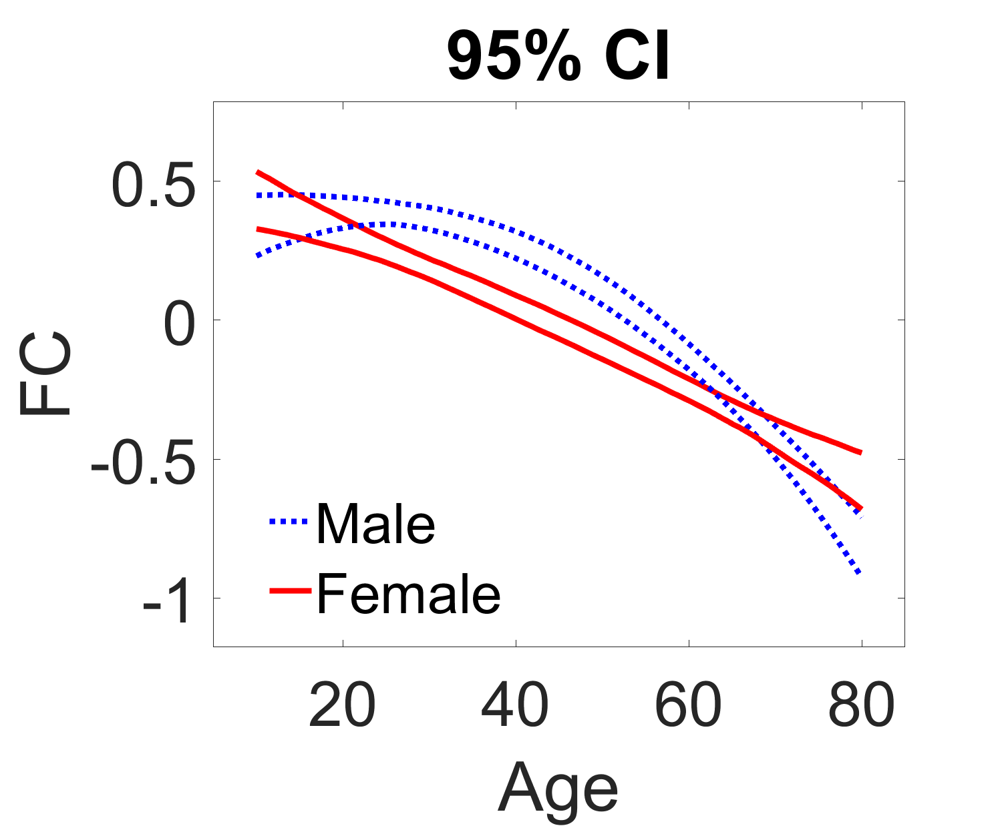
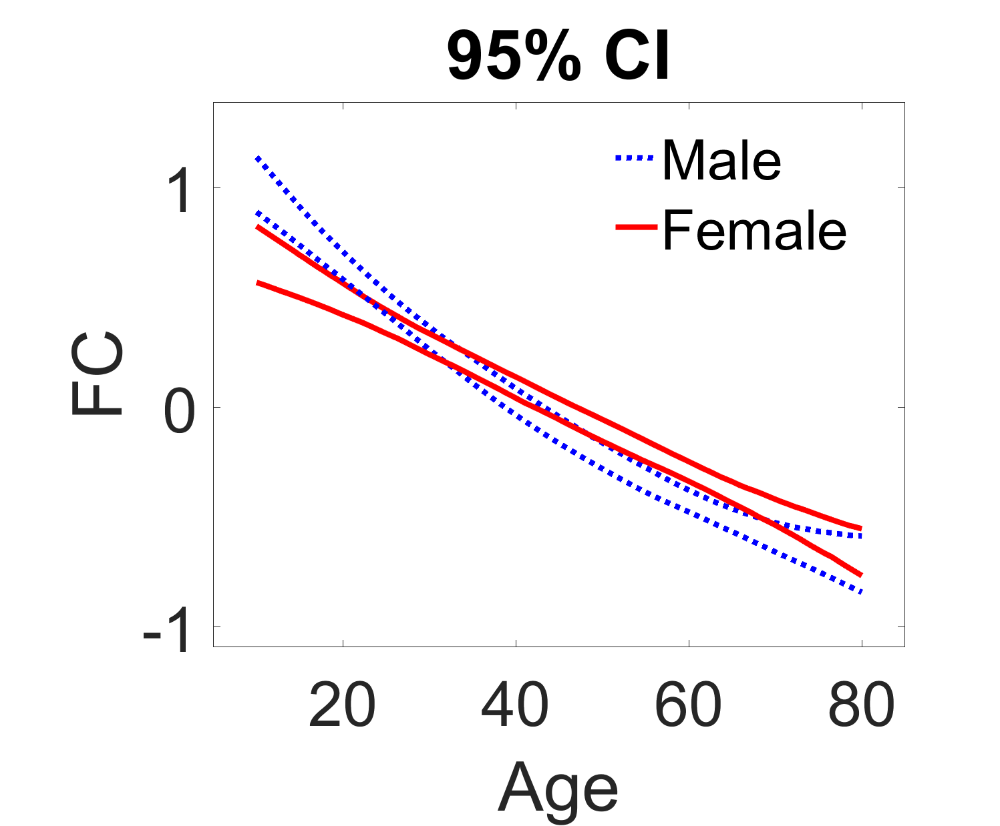

# Clustering-Enabled Regression for Aging Brain

## Description

This folder contains the functions we developed for our proposed clustering-enabled regression approach in the paper *Analysis of Functional Connectivity Changes from Childhood to Old Age: A Study Using HCP-D, HCP-YA, and HCP-A*. 

## Usage

- **clustering\_enabled\_reg.m**: The function for running our MCMC algorithm to get posterior samples for parameters;
- **posterior\_inf.m**: The function for performing posterior inference using posterior samples, including identifying region clusters.
- **plot_traj**: The function for plotting trajectories between region clusters.
-  **data\_harmonization**: The folder provides one function for data harmonization using the R package developed by Andrew Chen's [Github Repo](https://github.com/andy1764/FCHarmony). You are welcome to use other data harmonization methods.

## Example
- **run\_sample.m**: This function demonstrates how to execute our algorithm by analyzing the provided sample dataset, **sample_data.mat**, which includes synthetic data from 560 subjects, comprising age, sex, site, and FC matrices for 16 regions (Fisher's z transformed Pearson correlation).
 
 If successfully run through our algorithm, you will get the region clusters shown below, with numbers indicating the region index:

  
  
 and the trajectory plots between each pair of region clusters are shown below:
 

<table>
  <tr>
    <td>
      <figure style="text-align: center;">
        
        <figcaption>Cluster 1 ↔ Cluster 1</figcaption>
      </figure>
    </td>
    <td>
      <figure style="text-align: center;">
        
        <figcaption>Cluster 1 ↔ Cluster 2</figcaption>
      </figure>
    </td>
    <td>
      <figure style="text-align: center;">
        
        <figcaption>Cluster 1 ↔ Cluster 3</figcaption>
      </figure>
    </td>
  </tr>
  <tr>
    <td style="background-color: white;">
      <figure style="text-align: center;">
        
        <figcaption>Cluster 2 ↔ Cluster 2</figcaption>
      </figure>
    </td>
    <td style="background-color: white;">
      <figure style="text-align: center;">
        
        <figcaption>Cluster 2 ↔ Cluster 3</figcaption>
      </figure>
    </td>
    <td style="background-color: white;">
      <figure style="text-align: center;">
        
        <figcaption>Cluster 3 ↔ Cluster 3</figcaption>
      </figure>
    </td>
  </tr>
</table>

