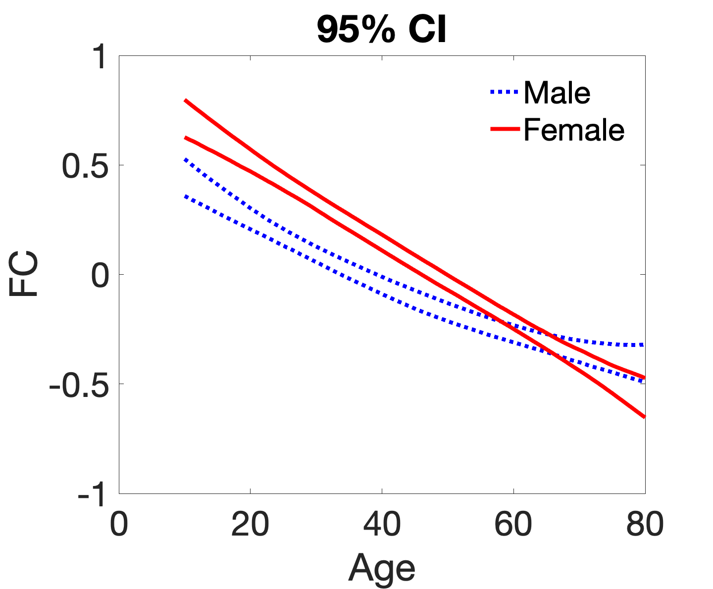

# Clustering-Enabled Regression for Aging Brain

## Description

This folder contains the functions we developed for our proposed clustering-enabled regression approach in the paper *Analysis of Functional Connectivity Changes from Childhood to Old Age: A Study Using HCP-D, HCP-YA, and HCP-A*. 

## Usage

- **clustering\_enabled\_reg.m**: The function for running our MCMC algorithm to get posterior samples for parameters;
- **posterior\_inf.m**: The function for performing posterior inference using posterior samples, including identifying region clusters.
- **plot_traj**: The function for plotting trajectories between region clusters.
-  **data\_harmonization**: The folder provides one function for data harmonization using the R package developed by Andrew Chen's [Github Repo](https://github.com/andy1764/FCHarmony). You are welcome to use other data harmonization methods.

## Example
- **run\_sample.m**: This function provides an example of running our algorithm and performing analysis using the provided sample data in **sample_data.mat**.
 
 If successfully run through our algorithm, you will get the region clusters shown below, with numbers indicating the region index:

  
  
 and the trajectory plot between cluster 1 and 2 is shown below:
 
 
 

